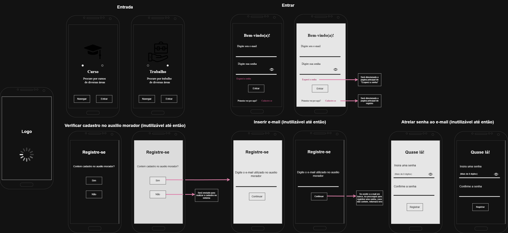
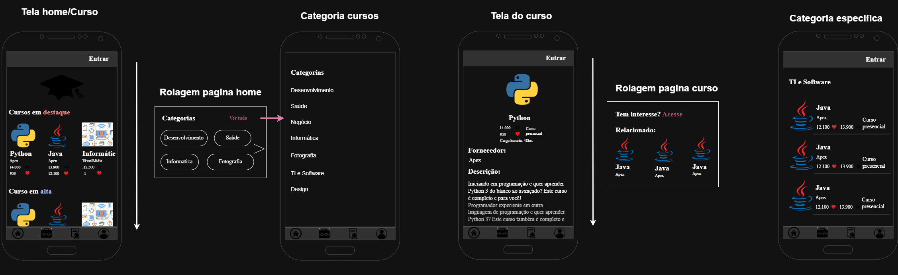
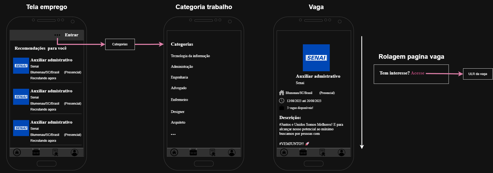

# Curso & Trabalho - Plataforma de Capacitação e Empregabilidade

O **Curso & Trabalho** é um aplicativo mobile desenvolvido em **2023**, criado com o objetivo de facilitar o acesso de pessoas em situação de vulnerabilidade social a **cursos profissionalizantes** e **oportunidades de emprego**.

O projeto foi desenvolvido em grupo por **3 integrantes**, onde:

- Um integrante foi responsável pela versão **Web**
- Um integrante foi responsável pelo **Banco de Dados**
- E a versão **Mobile Android** foi desenvolvida por mim

A aplicação mobile foi desenvolvida utilizando **Java no Android Studio**, com integração entre o aplicativo e o banco de dados através de **PHP + MySQL**.

O sistema funciona como uma plataforma de anúncios, onde:

- O **Administrador** pode cadastrar cursos e vagas
- O **Usuário** possui acesso apenas à visualização dos conteúdos disponíveis

A ideia principal do projeto era auxiliar pessoas com baixa renda a encontrarem oportunidades de capacitação e trabalho de forma simples e acessível.

# Screenshots

<p align="center">
  
</p>

<br>

<p align="center">
  
</p>

<br>

<p align="center">
  
</p>

# Funcionalidades

- Login de usuários
- Visualização de cursos
- Visualização de vagas de emprego
- Categorias de cursos
- Categorias de trabalho
- Visualização detalhada de cursos
- Visualização detalhada de vagas
- Cadastro de cursos pelo administrador
- Cadastro de vagas pelo administrador
- Cadastro de empresas
- Separação de cursos por categoria
- Separação de vagas por categoria
- Comunicação com banco de dados via PHP
- Integração com MySQL

---

# Ideia do Projeto

A proposta do aplicativo era criar uma plataforma simples e acessível para:

- Divulgação de cursos profissionalizantes
- Divulgação de vagas de emprego
- Facilitar o acesso à qualificação profissional
- Aproximar usuários de oportunidades de trabalho
- Centralizar informações em um único aplicativo

O aplicativo funciona como um intermediador entre empresas, cursos e usuários.

# Tecnologias Utilizadas

- Java (Android)
- XML (Interface Android)
- Android Studio
- MySQL
- PHP (API de comunicação)

# Arquitetura Utilizada

O projeto foi estruturado utilizando uma arquitetura baseada em separação por camadas, seguindo conceitos próximos de uma arquitetura em:

- **Camada de Apresentação (UI)**
- **Camada de Dados**
- **Camada de Modelos**
- **Camada de Comunicação com Banco**

Além disso, o sistema utiliza o padrão:

- **DAO (Data Access Object)** para manipulação dos dados
- **DTO (Data Transfer Object)** para transporte das informações entre as camadas

---

A comunicação entre o aplicativo Android e o banco de dados foi realizada utilizando:

- Aplicação Android em Java
- Scripts PHP responsáveis pelas consultas
- Banco de dados MySQL

---
# Organização das Pastas

```bash
cursoetrabalho/
│
├── activity/
│   ├── Telas principais do aplicativo
│   ├── Login
│   ├── Cadastro de cursos
│   ├── Cadastro de vagas
│   ├── Visualização de cursos
│   └── Visualização de trabalhos
│
├── adapter/
│   ├── Responsável pelos RecyclerViews
│   ├── Listagem de cursos
│   ├── Listagem de categorias
│   └── Listagem de trabalhos
│
├── DAO/
│   ├── Comunicação com banco de dados
│   ├── Consultas SQL
│   ├── Inserções
│   └── Manipulação de dados
│
├── DTO/
│   ├── Objetos de transferência de dados
│   ├── CursoDTO
│   ├── EmpresaDTO
│   └── VagaDTO
│
├── fragments/
│   ├── Separação de telas da Home
│   ├── Fragment de Cursos
│   └── Fragment de Trabalhos
│
├── model/
│   ├── Modelos do sistema
│   ├── Categorias
│   ├── Postagens
│   └── Trabalhos
│
├── conexaoBD/
    └── Classe responsável pela conexão com banco
```

---

# Documentação

Toda a documentação do projeto foi salva dentro do próprio repositório, no arquivo:

```bash
Documentação.docx
```

O documento apresenta todo o processo de desenvolvimento da plataforma, incluindo planejamento, requisitos do sistema, regras de negócio, protótipos de tela, arquitetura utilizada, testes realizados, implantação e modelagem do banco de dados.

Também estão documentados os scripts SQL utilizados na criação da estrutura do banco MySQL, incluindo tabelas, relacionamentos, chaves estrangeiras e organização dos dados da aplicação.